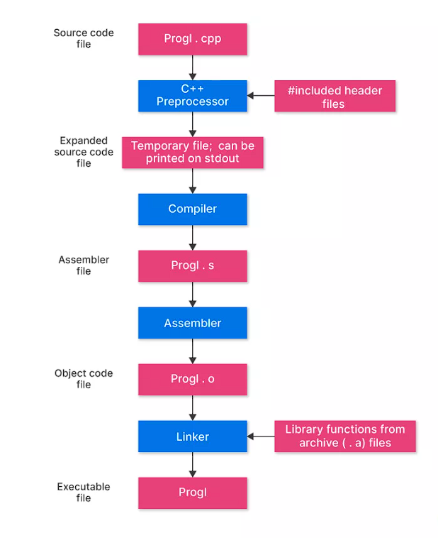

# What is Programming?

Programming is the process of  creating a set  of instructions that tell a computer how to perform a task.

example: your friend  want  a coffee and he didn't know how to make a coffee, then he called you and asked you how make a coffee then you told him how to make a coffee so you gave instructions and he followed to make a coffee like wise programming is like that we give some instructons to machine to complete certain task.

# How can we do programming?

So In the earlier example we discuss about  how you gave instructions to your friend for making a coffee.

It is easy cause you and your friend know understand the language and instructions

But When comming to machines it unable to understand the language (english).

It only understand (0,1) only even though you write a program in english , machine needs some one to transalate the program which is known as compiler and it follows certain steps for transalation or converstion

Example : we write A , B, C

Machine doesn't understand A, B, C it only knows 0,1

So here

    0 -> low voltage (no current passing)

    1 -> high voltage(current passing through the circut)

So here 0,1 are called machine level language

In computer programming machine code is  any low-level programming language

    example :5+3   for machine we need to give these in series of ones and zeros which is complex for us

    101   -> binary format for 5

    11 -> binary format for 3

    and performs operation using this machine code

**Machine code** is specific to that machine only we can't use same machine code to every machine

**Assembly Language:** is a type of low level programming language that is intended to commmunicate directly with a computers hardware.

but here it's not 0,1 instead of 0,1 it takes every line of text in code  into single machine instruction

    example: 5+3

    in assembly language it converts into

    ADD 5,3 -> here add is a minimonic which is  corresponding to machine.

Assembly language is easy to understand and it doesn't specific to any os or computer architecture

**High-Level Language:-** Is more near  to human languages (english) they are easy and less complex than machine code.

Mostly we write programs in highlevel language only later we use compiler or interpreter to convert it into machine level code.

Example: c/c++ , java, python

High level Language are mostly follows three programming paradigims types

1. **Procedural :** Focuses on procedures (functions) and step-by-step instructions and executes in structural or series of order  example: c, basic, pascal.
2. **Functional:**  Uses functions  to execute and mainly focus on computation as evaluation rather than execution step by step , avoids changing state(variables are immutable) cause of parameters  Example: Pyhton javascript .
3. **Object-Oriented :** Organizes code around objects and classes and mostly deals with properties and methods  Example: Java C#.

# What is C++ Programming Language?

C++ is one of the world's most popular programming language which supports multiple paradigams like object oriented programming and procedural programming.

Developed by Bjarne Stroustrup in 1979

# C++ File Extenstion

 A file extension is the suffix at the end of a filename, usually after a dot (`.`), that indicates the file type and tells the operating system which program can open it.

* **Format** : `filename.extension`
* Example: `hello.cpp`, `report.pdf`, `image.jpg`

 we use both `.cpp` and `.cc` are valid C++ source file extensions.

The difference is mostly **convention and platform preference** — `.cpp` is more common on Windows and in Microsoft ecosystems,

 while `.cc` is widely used on Unix/Linux systems. Functionally, compilers treat them the same

# Flow of Execution



## Example

```cpp
// Prog1.cpp
#include <iostream>
using namespace std;

int main() {
    cout << "Hello, Yaswanth!" << endl;
    return 0;
}

```

In terminal we can simply  run these  commands to run program

g++ prog1.cpp -o prog1

./prog1

### 🔹1. **Source Code File**

Human-readable C++ program written in `.cpp` file **(e.g., `prog1.cpp`).**

* **Role** : Contains your logic, functions, and instructions.
* Analogy: Your blueprint for a machine.

### 🔹 2. **C++ Preprocessor**

**The preprocessor handles directives like `#include`, `#define`, and removes comments.**

* **Output** : A temporary expanded source file (often seen with `gcc -E prog1.cpp`).
* **Visibility** : You can dump this expanded file to stdout to see all included headers expanded.
* Handles `#include <iostream>` → pulls in the actual code from the iostream header example cin,cout actual code pulls into the program.
* Removes comments.
* Expands macros (`#define`, etc.) like replace identifiers with actual values.

  **Result** : A big temporary file with all headers and macros expanded.

  **Analogy** : Like unpacking all tools and instructions before building — you now have the full blueprint.

For Preprocessing run the

```cpp
g++ -E prog1.cpp -o prog1.i
```

Now we will get output as  prog1.i

### 🔹 3. **Compiler**

**Compiler translates preprocessed C++ code into assembly language instructions.**

* **Output** : `.s` file (assembly code).
* **Visibility** :Run `g++ -S prog1.cpp` → generates `prog1.s` (you can open it in a text editor to see assembly instructions like `mov`, `call`).
* **Output** : `Prog1.s` (Assembly code)
* **What it does** :

  * Converts C++ code into  **assembly language** .
  * Assembly is low-level, human-readable instructions for the CPU.

    **Result** : `Prog1.s` — a file with instructions like `mov`, `call`, `jmp`.

  **Analogy** : Translating your blueprint into step-by-step build instructions.

  Run below  Compilation to assembly

  ```
  g++ -S prog1.cpp -o prog1.s
  ```

now we get prog1.s file

### 🔹 4. **Assembler**

**Assembler converts assembly (`.s`) into machine code (binary instructions).**

* **Output** : `.o` file (object code).
* **Visibility** : Run `g++ -c prog1.cpp` → generates `prog1.o`.
  This is binary, not human-readable, but you can inspect with tools like `objdump`.
* **What it does** :

  * Converts assembly into **machine code** (binary).
  * This is what the CPU actually understands.

    **Result** : `Prog1.o` — compiled machine code, but not yet runnable.

    **Analogy** : Building individual robot parts from instructions.

### 🔹 5. **Linker**

**Linker combines your object file (`.o`) with required libraries (like `libstdc++` for `iostream`).**

* **Output** : Executable file (`a.out` by default, or `prog1` if specified).
* **Visibility** : Run `g++ prog1.o -o prog1` → produces executable.
* **What it does** :

  * Combines your object code with external libraries.
  * Resolves function calls like `cout`.

  **Result** : `Prog1` — a complete, runnable program.

 **Analogy** : Assembling all parts into a working robot and plugging it into power.

Assembly to object code

```cpp
g++ -c prog1.cpp -o prog1.o
```

 we will get output as  prog1.o

<pre><div># Linking to executable</div></pre>

```cpp
g++ prog1.o -o prog1
```

## 6. Final Step: Execution

**The operating system loads the executable into memory and starts execution at the `main()` function.**

* **Output** : Program runs and produces runtime output (e.g., prints to console).
* **Visibility** : Run `./prog1` → see program output.

Now when you run `./Prog1` or `Prog1.exe`, the  **runtime flow begins** :

```
Output:
Hello, Yaswanth!
```

Execution starts at `main()`, runs line by line, and ends at `return 0;`.

# Preprocessing only

g++ -E prog1.cpp -o prog1.i

# Compilation to assembly

g++ -S prog1.cpp -o prog1.s

# Assembly to object code

g++ -c prog1.cpp -o prog1.o

# Linking to executable

g++ prog1.o -o prog1

# Execution

./prog1

* `.i` → Preprocessed source (expanded headers/macros).
* `.s` → Assembly code (human-readable low-level instructions).
* `.o` → Object code (binary machine instructions).
* Executable → Final runnable program.

you **can see each step** by using compiler flags (`-E`, `-S`, `-c`) before linking.
