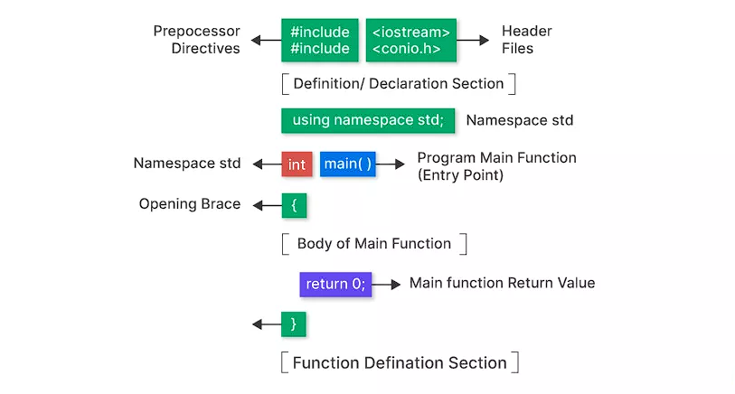

# First C++ program

1. every program file name should end with .cpp

```cpp
#include <iostream>   // 1. Header file for input/output

using namespace std;  // 2. Namespace declaration

int main() {          // 3. Main function - entry point
    cout << "Hello, Yaswanth!" << endl;  // 4. Statement: print output
    return 0;         // 5. Return statement
}

```


Every C++ program generally includes:

1. **Header Files**

   * Example: `#include <iostream>`
   * Purpose: Brings in standard input/output functionality (`cin`, `cout`).
   * Analogy: Like importing a toolbox before starting work.
2. **Namespace Declaration**

   * Example: `using namespace std;`
   * Purpose: Lets you use standard library names (`cout`, `cin`) without prefixing them with `std::`.
   * Optional, but common in beginner programs.
3. **Main Function**

   * Example: `int main() { ... }`
   * Purpose: Entry point of the program. Execution always starts here.
   * Must return an integer (usually `0` for success).
4. **Statements**

   * Example: `cout << "Hello, World!";`
   * Purpose: Actual instructions executed by the program.
   * Ends with a semicolon `;`.
5. **Return Statement**

   * Example: `return 0;`
   * Purpose: Signals successful completion to the operating system.
   * Required in `main()` (though modern compilers may allow omission).

   ## Explanation of Flow


   * **Preprocessing** : `#include <iostream>` expands to include the I/O library code.
   * **Compilation** : Code is translated into assembly.
   * **Assembly** : Assembly converted into object code.
   * **Linking** : Links with standard C++ libraries (like `iostream`).
   * **Execution** : Starts at `main()`, prints `"Hello, Yaswanth!"`, then exits.





Here int is not namespace it is a return type

### **1. Preprocessor Directives**


```cpp
#include <iostream>
#include <conio.h>
```

* `#include`: Tells the preprocessor to include external files.
* `<iostream>`: Provides input/output functions like `cin`, `cout`.
* `<conio.h>`: (non-standard, mostly used in Turbo C++) for console I/O like `getch()`.

 *Preprocessor runs before compilation and expands these headers into your code.*

### 2. **Definition/Declaration Section**

* This is where you **declare variables, constants, or functions** before `main()`.
* Example:


  ```cpp
  int x;           // variable declaration
  const float PI = 3.14;  // constant definition
  ```

### 3. **Namespace Declaration**


```cpp
using namespace std;
```

* Tells the compiler to use the  **standard namespace** .
* Avoids writing `std::cout`, `std::cin` — you can just use `cout`, `cin`.
* Namespaces (especially std, for avoiding naming conflicts)

### 4. **Main Function**


```
int main()
```

* Entry point of every C++ program.
* The program starts executing from here.
* Must return an integer (`int`) to indicate success or failure.

### 5.  Opening Brace `{`

* Marks the  **start of the main function body** .
* All executable code goes inside these braces.

### 6. **Body of Main Function**

* Contains the actual logic of your program.
* Example:


  ```
  cout << "Hello, Yaswanth!";
  ```

### 7. **Return Statement**


```cpp
return 0;
```

* Signals successful program termination.
* `0` means success; other values can indicate errors.

## 8.  Closing Brace  `}`

* Marks the  **end of the main function** .
* No code should go outside this unless it’s part of another function or declaration.


# Comments in C++

What Are Comments?

* **Definition** : Comments are non-executable text in your code.
* **Purpose** : They help explain logic, document code, or temporarily disable code.
* **Compiler Behavior** : The compiler ignores comments during preprocessing and compilation.

## 🔹 Types of Comments in C++

### 1. **Single-Line Comments**

* Syntax: `// comment text`
* Everything after `//` on that line is ignored.
* Example:
  cpp

  ```
  #include <iostream>
  usingnamespacestd;

  int main() {
      // This prints a message to the console
      cout << "Hello, Yaswanth!"<< endl;
      return0; // End of program
  }
  ```

### 2. **Multi-Line (Block) Comments**

* Syntax: `/* comment text */`
* Can span multiple lines.
* Example:
  cpp

  ```
  #include <iostream>
  usingnamespacestd;

  int main() {
      /* This is a multi-line comment.
         It can explain complex logic
         or temporarily disable code. */
      cout << "Hello, World!"<< endl;
      return0;
  }
  ```

## Key Notes

* **Nested block comments are not allowed** :

```
  /* Outer comment
     /* Inner comment */// ❌ Error
  */
```

* Use **single-line comments** for short notes, **multi-line comments** for longer explanations.
* Comments should  **explain why** , not just repeat what the code already says.
