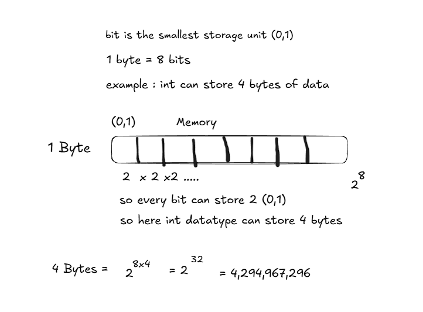

# **Data Types in C++** .

These define what kind of values a variable can store and how much memory it uses.

## What Are Data Types?

* A data type specifies the type of data a variable can hold (integer, floating-point, character, etc.).
* **Purpose** : Helps the compiler allocate memory and enforce rules on operations.

## Categories of Data Types in C++

### 1. **Basic (Primitive) Data Types**

These are the fundamental building blocks:

| Type       | Description                                                   | Example                       | Typical Size* |
| ---------- | ------------------------------------------------------------- | ----------------------------- | ------------- |
| `int`    | Integer (whole numbers)                                       | `int age = 25;`             | 4 bytes       |
| `float`  | Single-precision floating-point<br />(Upto 7 decimal places)  | `float pi = 3.14f;`         | 4 bytes       |
| `double` | Double-precision floating-point<br />(upto 15 decimal places) | `double salary = 50000.75;` | 8 bytes       |
| `char`   | Single character                                              | `char grade = 'A';`         | 1 byte        |
| `bool`   | Boolean (true/false)                                          | `bool isActive = true;`     | 1 byte        |

\*Size may vary depending on compiler/system.



### 2. **Derived Data Types (Non primitive data types)**

Built from basic types:

| Type                | Description                         | Example                    |
| ------------------- | ----------------------------------- | -------------------------- |
| **Array**     | Collection of same type elements    | `int marks[5];`          |
| **Pointer**   | Stores memory address of a variable | `int *ptr;`              |
| **Function**  | Functions returning values          | `int add(int a, int b);` |
| **Reference** | Alias for another variable          | `int &ref = x;`          |

### 3. **User-Defined Data Types**

Created by programmers:

| Type                    | Description                         | Example                                     |
| ----------------------- | ----------------------------------- | ------------------------------------------- |
| **struct**        | Groups variables of different types | `struct Student { int id; char grade; };` |
| **class**         | Blueprint for objects (OOP)         | `class Car { public: int speed; };`       |
| **enum**          | Defines named constants             | `enum Color { Red, Green, Blue };`        |
| **typedef/using** | Creates new type names              | `typedef unsigned int uint;`              |

### 4. **Modifiers**

Used with basic types to change range/size:

| Modifier     | Effect                   | Example                        |
| ------------ | ------------------------ | ------------------------------ |
| `short`    | Smaller integer range    | `short x = 100;`             |
| `long`     | Larger integer range     | `long y = 100000;`           |
| `signed`   | Allows negative values   | `signed int a = -5;`         |
| `unsigned` | Only non-negative values | `unsigned int b = 10;`<br /> |

| Type                       | TypicalBitWidth | TypicalRange                                              |
| -------------------------- | --------------- | --------------------------------------------------------- |
| `char`                   | 1byte           | -127to127(signed)or0to255(unsigned)                       |
| `unsigned char`          | 1byte           | 0to255                                                    |
| `signed char`            | 1byte           | -127to127                                                 |
| `int`                    | 4bytes          | -2,147,483,648to2,147,483,647                             |
| `unsigned int`           | 4bytes          | 0to4,294,967,295                                          |
| `signed int`             | 4bytes          | -2,147,483,648to2,147,483,647                             |
| `short int`              | 2bytes          | -32,768to32,767                                           |
| `unsigned short int`     | 2bytes          | 0to65,535                                                 |
| `signed short int`       | 2bytes          | -32,768to32,767                                           |
| `long int`               | 8bytes          | -9,223,372,036,854,775,808to9,223,372,036,854,775,807     |
| `signed long int`        | 8bytes          | Sameas `<span>long </span><span>int</span>`             |
| `unsigned long int`      | 8bytes          | 0to18,446,744,073,709,551,615                             |
| `long long int`          | 8bytes          | -(2^63)to(2^63)-1                                         |
| `unsigned long long int` | 8bytes          | 0to18,446,744,073,709,551,615                             |
| `float`                  | 4bytes          | ~±3.4E38(approx,dependsonIEEE-754)                       |
| `double`                 | 8bytes          | ~±1.7E308(approx,IEEE-754)                               |
| `long double`            | 12bytes(varies) | ~±1.1E4932(implementationdependent)                      |
| `wchar_t`                | 2or4bytes       | Representsonewidecharacter(Unicode/extendedcharactersets) |


## What Are Signed Numbers?

* A **signed number** is a number that can be  **positive or negative** .
* In computers, signed numbers are stored in **binary** using special rules so the system knows whether the value is positive or negative.
* The **sign** is indicated by the **most significant bit (MSB)** — the leftmost bit.

## 🔹 How Signed Numbers Work (Two’s Complement System)

Most modern computers use **two’s complement** to represent signed integers.

* **MSB = 0 → Positive number (or zero)**
* **MSB = 1 → Negative number**

## Range of Signed Numbers

For  **8-bit signed integers** :

* Minimum = -128
* Maximum = +127

So the range is:

-(2^7) to (2^7) -1

For  **n-bit signed integers** :

−2^(n−1) to 2^(n−1)−1

## 🔹 Unsigned vs Signed

* **Unsigned numbers** : Only positive values (MSB is part of the magnitude).
* Example (8-bit): 0 to 255
* **Signed numbers** : Can be positive or negative (MSB is the sign).
* Example (8-bit): -128 to +127


## 🔹 Important Notes

* Sizes and ranges can vary depending on **compiler** and **system architecture** (32-bit vs 64-bit).
* To check exact sizes on your system, use the `sizeof()` operator.

## 🔹 Example Program to Check Sizes

cpp

```cpp
#include <iostream>
using namespace std;

int main() {
    cout << "Size of char: " << sizeof(char) << " byte(s)" << endl;
    cout << "Size of int: " << sizeof(int) << " byte(s)" << endl;
    cout << "Size of short: " << sizeof(short) << " byte(s)" << endl;
    cout << "Size of long: " << sizeof(long) << " byte(s)" << endl;
    cout << "Size of long long: " << sizeof(long long) << " byte(s)" << endl;
    cout << "Size of float: " << sizeof(float) << " byte(s)" << endl;
    cout << "Size of double: " << sizeof(double) << " byte(s)" << endl;
    cout << "Size of long double: " << sizeof(long double) << " byte(s)" << endl;
    cout << "Size of wchar_t: " << sizeof(wchar_t) << " byte(s)" << endl;
    return 0;
}

```

output

```
Size of char: 1 byte(s)
Size of int: 4 byte(s)
Size of short: 2 byte(s)
Size of long: 4 byte(s)
Size of long long: 8 byte(s)
Size of float: 4 byte(s)
Size of double: 8 byte(s)
Size of long double: 16 byte(s)
Size of wchar_t: 2 byte(s)
```

To find out the data type range limit

```cpp
#include <iostream>
#include <limits>
using namespace std;

int main() {

    std::cout << "Int Min " << std::numeric_limits<int>::min() << endl;
    std::cout << "Int Max " << std::numeric_limits<int>::max() << endl;
    std::cout << "Unsigned Int  Min " << std::numeric_limits<unsigned int>::min() << endl;
    std::cout << "Unsigned Int Max " << std::numeric_limits<unsigned int>::max() << endl;
    std::cout << "Long Int Min " << std::numeric_limits<long int>::min() << endl;
    std::cout << "Long Int Max " << std::numeric_limits<long int>::max() << endl;

    std::cout << "Unsigned Long Int Min " << std::numeric_limits<unsigned  long int>::min() <<endl;
    std::cout << "Unsigned Long Int Max " << std::numeric_limits<unsigned  long int>::max() << endl;

}
```

```
Int Min -2147483648
Int Max 2147483647
Unsigned Int  Min 0
Unsigned Int Max 4294967295
Long Int Min -2147483648
Long Int Max 2147483647
Unsigned Long Int Min 0
Unsigned Long Int Max 4294967295
```

## Example Program

```cpp
#include <iostream>
usingnamespacestd;

int main() {
    intage = 22;          // integer
    doublesalary = 50000; // floating-point
    chargrade = 'A';      // character
    boolisActive = true;  // boolean

    cout << "Age: "<< age << endl;
    cout << "Salary: "<< salary << endl;
    cout << "Grade: "<< grade << endl;
    cout << "Active: "<< isActive << endl;

    return0;
}
```

**Output:**

```
Age: 22
Salary: 50000
Grade: A
Active: 1
```

# Special Data types

## `void` in C++

* **Definition** : `void` is a special data type that represents *no value* or  *no return type* .
* **Usage** :

1. **Function return type** :
   cpp

```cpp
void greet() {
    cout << "Hello, Yaswanth!" << endl;
}

```

    → This function does not return anything

**2. Function parameters** :

```cpp
int main(void) { ... }
```

→ Means the function takes no arguments (though in modern C++ you usually just write `int main()`).

**3. Void pointers** :

```
void* ptr;
```

→ A generic pointer that can point to any data type, but must be cast before use.

`void` = absence of type or value.

## 🔹 Wide Characters (`wchar_t`)

 `wchar_t` is a data type used to represent *wide characters* (larger character set than `char`).

* **Purpose** : Supports Unicode or extended character sets beyond ASCII (like Hindi, Chinese, Japanese).
* **Size** : Typically 2 bytes on Windows, 4 bytes on Linux/Unix.
* **Usage** :

```cpp
#include <iostream>
using namespace std;

int main() {
    wchar_t w = L'अ';   // Hindi character (Devanagari script)
    wcout << L"Wide character: " << w << endl;
    return 0;
}

```

* `L` prefix → denotes a wide-character literal.
* `wcout` → wide-character version of `cout`.

 `wchar_t` = supports international/multibyte characters.

String data type gets memory allocated dynamically

## Key Takeaways

* **Basic types** : int, float, double, char, bool.
* **Derived types** : arrays, pointers, references, functions.
* **User-defined types** : struct, class, enum, typedef.
* **Modifiers** : short, long, signed, unsigned.
