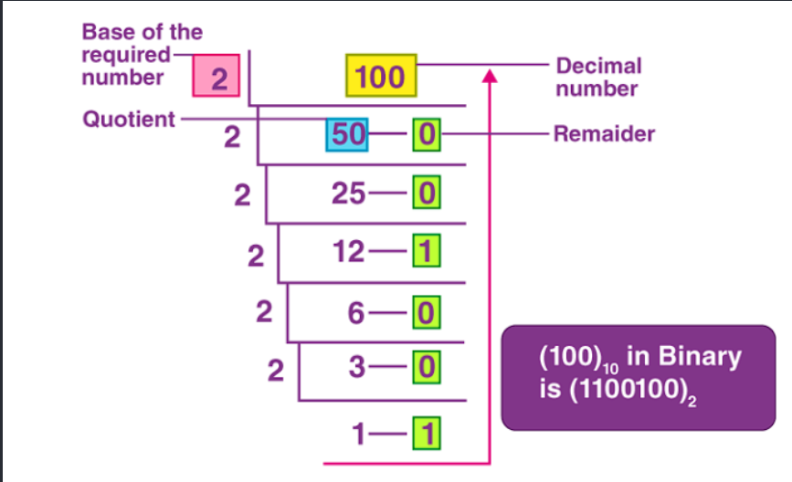
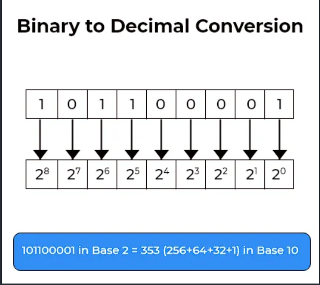
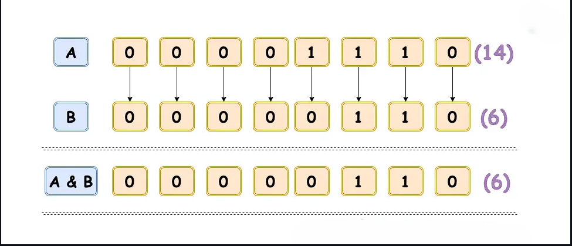
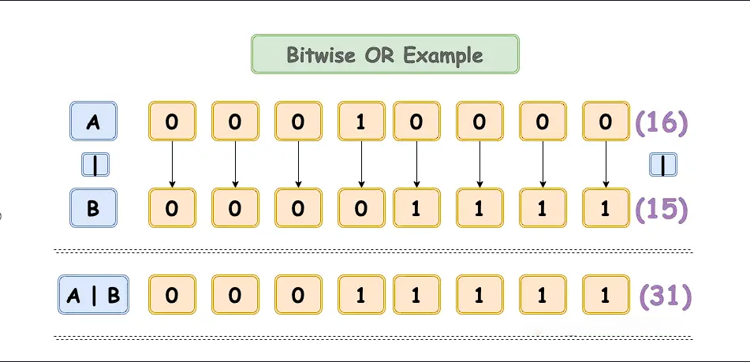
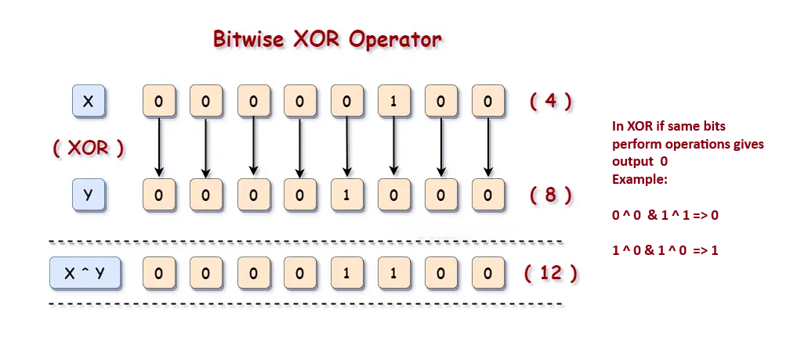
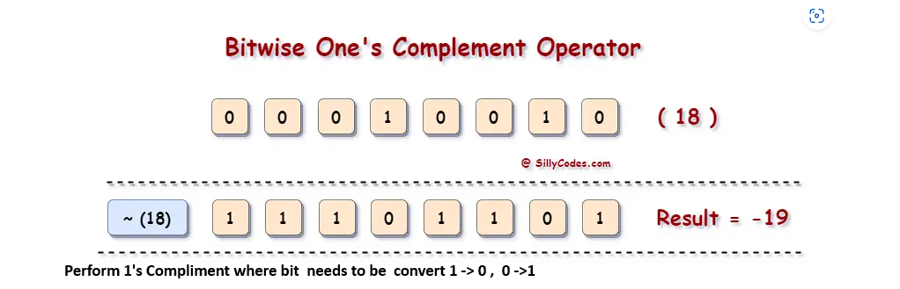
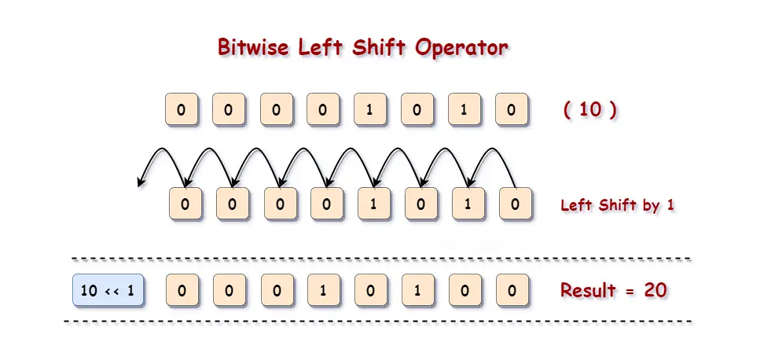
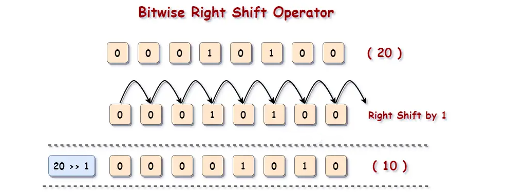

## What Are Operators?

* Operators are special symbols that perform operations on operands (variables or values).
* **Operands** : The data the operator acts upon.
* Example:

  ```cpp
  int a = 10, b = 5;
  int sum = a + b;   // '+' is the operator, a and b are operands
  ```

## 🔹 Categories of Operators in C++

### 1. **Arithmetic Operators**

Perform mathematical operations:

* `+` Addition
* `-` Subtraction
* `*` Multiplication
* `/` Division
* `%` Modulus (remainder)

```cpp
int x = 10, y = 3;
cout << x + y;  // 13
cout << x % y;  // 1
```

### 2. **Relational (Comparison) Operators**

Compare two values, return `true (1)` or `false (0)`:

* `==` Equal to
* `!=` Not equal to
* `<` Less than
* `>` Greater than
* `<=` Less than or equal to
* `>=` Greater than or equal to

```cpp
int a = 5, b = 10;
cout << (a < b);   // 1 (true)
cout << (a == b);  // 0 (false)
```

### 3. **Logical Operators**

Used in conditions:

* `&&` Logical AND → true if both are true
* `||` Logical OR → true if at least one is true
* `!` Logical NOT → inverts truth value

```cpp
bool p = true, q = false;
cout << (p && q);  // 0 (false)
cout << (p || q);  // 1 (true)
cout << (!p);      // 0 (false)
```

### 4. **Assignment Operators**

Assign values to variables:

* `=` Simple assignment
* `+=` Add and assign
* `-=` Subtract and assign
* `*=` Multiply and assign
* `/=` Divide and assign
* `%=` Modulus and assign

```cpp
int x = 10;
x += 5;   // x = x + 5 → 15
```

### 5. **Increment/Decrement Operators**

* `++` Increment by 1
* `--` Decrement by 1

```cpp
int a = 5;
cout << ++a;  // 6 (pre-increment)
cout << a--;  // 6 (post-decrement, then becomes 5)
```

### **6. Bitwise Operators**

Work at the binary (bit) level:

* `&` Bitwise AND
* `|` Bitwise OR
* `^` Bitwise XOR
* `~` Bitwise NOT
* `<<` Left shift
* `>>` Right shift

```cpp
int a = 5;   // 0101 in binary
int b = 3;   // 0011 in binary
cout << (a & b);  // 1 (0001)
cout << (a | b);  // 7 (0111)
```

---

# Converting into Decimal to binary



---

* **Humans** : We naturally use **decimal (base 10)** because we have 10 digits (0–9).
  Example: `(100)₁₀` means 1×10² + 0×10¹ + 0×10⁰ = 100.
* **Computers** : They operate in **binary (base 2)** because their hardware (transistors) can only be **ON (1)** or  **OFF (0)** .
  Example: `(1100100)₂` means 1×2⁶ + 1×2⁵ + 0×2⁴ + 0×2³ + 1×2² + 0×2¹ + 0×2⁰ = 100.

So we humans use base 10  format

* Easy for us to count with fingers (10 digits).
* Everyday arithmetic is built around 0–9.

Computers or machines uses base 2 format

* Hardware is built on  **electrical signals** :
  * High voltage = 1
  * Low voltage = 0
* This makes binary the most reliable way to represent data.

So we convert decimal numbers to binary to understand how they’re stored and processed in memory.

Example : (100)₁₀  which is in base 10 now convert it into binary format base 2

---

## Decimal to Binary Conversion: Step-by-Step

We want to convert **100 (base 10)** into  **binary (base 2)** .

### 🔹 Step 1: Divide by 2 repeatedly

At each step:

* Divide the number by 2.
* Record the **quotient** and the  **remainder** .
* Continue until the quotient becomes 0.

| DivisionStep | Quotient | Remainder |
| ------------ | -------- | --------- |
| 100÷2       | 50       | 0         |
| 50÷2        | 25       | 0         |
| 25÷2        | 12       | 1         |
| 12÷2        | 6        | 0         |
| 6÷2         | 3        | 0         |
| 3÷2         | 1        | 1         |
| 1÷2         | 0        | 1         |

### Step 2: Read Remainders Bottom to Top

Now take the remainders  **from bottom to top** :

Code

```markdown
1 1 0 0 1 0 0
```

### Final Result

* **(100)₁₀ = (1100100)₂**
* This means:   apply from( right to left)
* * **1×2⁶ + 1×2⁵ + 0×2⁴ + 0×2³ + 1×2² + 0×2¹ + 0×2⁰**
  * **= 64 + 32 + 0 + 0 + 4 + 0 + 0 = 100**

## What Does `(1100100)₂` Mean?

* This is the **binary representation** of `100`.
* The subscript `₂` means “this number is in base 2.”
* It uses powers of 2:

  * **1100100= 1×2⁶ + 1×2⁵ + 0×2⁴ + 0×2³ + 1×2² + 0×2¹ + 0×2⁰**
* * **= 64 + 32 + 0 + 0 + 4 + 0 + 0 = 100**

  ---

## what if numbers have decimal values like 8.25 how can we convert it into binary?

## Rules for fractional decimal to binary

When converting a **fractional decimal** to binary:

1. **Multiply the fraction by 2.**
2. The **integer part of the result** becomes the next binary digit.
3. The **fractional part of the result** is carried forward for the next step.
4. Repeat until the fractional part becomes **exactly 0** (terminating fraction) OR until you’ve reached the desired precision (non‑terminating fraction).

## Converting 8.25 to Binary

 we know that binary number for 8 is 1000

## Walkthrough with 0.25

based on the rules

**1. Integer part (8):**

* 8 in binary = `1000`.

**2. Fractional part (.25):**

```markdown
Step 1:
0.25 × 2 = 0.5
→ integer part = 0 (first binary digit after the point)
→ fractional part = 0.5 (carry forward)

Step 2:
0.5 × 2 = 1.0 
→ integer part = 1 (next binary digit)
→ fractional part = 0 (stop here because the fraction became 0.)
```

So `.25` in binary = `.01`.

so  we have  8.25 now binary for 8 is 1000 and we have .25 now we have to multiply his with 2  0.25 *2=0.5 so now we got integer part 0 and still we have fraction part  0.5 and now multiply 0.5 *2 =1.0 now we got integer part as 1  and we got fraction part as 0  so process stops and now we need to add these integer numbers which we got 0 and 1 from the multiplying fractions and add it after the binary number of 8 which is 1000 now it will be   1000.01 and this becomes binary number.

---

## How Text Becomes Binary

Computers don’t understand letters directly — they only understand  **0s and 1s** .
So text is converted into binary using **character encoding systems** like **ASCII** or  **Unicode** .

### 1. **Character Encoding**

* Each character (like `A`, `B`, `a`, `1`, `!`) is assigned a  **numeric code** .
* Example in ASCII:
  * `A` → 65
  * `B` → 66
  * `a` → 97
  * Space () → 32

### 2. **Convert Number to Binary**

* Once you have the numeric code, convert it into binary.
* Example:
  * `A` → 65 → Binary = `01000001`
  * `B` → 66 → Binary = `01000010`
  * `a` → 97 → Binary = `01100001`

### 3. **Combine for Full Text**

If you want to convert `"ABa"`:

* `A` → `01000001`
* `B` → `01000010`
* `a` → `01100001`

 Final binary string:

Code

```
01000001 01000010 01100001
```

## 🔹 Example: "Hi"

* `H` → ASCII 72 → Binary `01001000`
* `i` → ASCII 105 → Binary `01101001`

Result:

Code

```
01001000 01101001
```

---

# Converting Binary to decimal



Each digit (bit) represents a power of 2, starting from the **rightmost bit** (which is   2^0) and moving left.

**Example:  Binary Number:**

<pre><div>1 0 1 1 0 0 0 0 1</div></pre>

## Binary to Decimal Conversion of `101100001`

| Bit | Position | Power of 2 | Operation (Bit × Power) | Result / Action |
| --- | -------- | ---------- | ------------------------ | --------------- |
| 1   | 8        | 2^8 = 256  | 1 × 256 = 256           | ✅ Include 256  |
| 0   | 7        | 2^7 = 128  | 0 × 128 = 0             | ❌ Skip         |
| 1   | 6        | 2^6 = 64   | 1 × 64 = 64             | ✅ Include 64   |
| 1   | 5        | 2^5 = 32   | 1 × 32 = 32             | ✅ Include 32   |
| 0   | 4        | 2^4 = 16   | 0 × 16 = 0              | ❌ Skip         |
| 0   | 3        | 2^3 = 8    | 0 × 8 = 0               | ❌ Skip         |
| 0   | 2        | 2^2 = 4    | 0 × 4 = 0               | ❌ Skip         |
| 0   | 1        | 2^1 = 2    | 0 × 2 = 0               | ❌ Skip         |
| 1   | 0        | 2^0 = 1    | 1 × 1 = 1               | ✅ Include 1    |

### Add Only the Values Where Bit = 1

256+64+32+1=353

* each bit is multiplied by its power of 2.
* If the bit is 1 → include the value.
* If the bit is 0 → skip it.
* Add all included values to get the decimal number.

---

# 1. Bitwise AND



The **bitwise AND** operation compares each bit of two binary numbers:

* If  **both bits are 1** , the result is  **1** .
* Otherwise, the result is  **0** .

It’s like checking if  **both switches are ON** .

## 🔹 Example from the Image

Let’s take two 8-bit binary numbers:

Code

```
A = 00001110   → Decimal: 14  
B = 00000110   → Decimal: 6
```

Now apply  **bitwise AND** :

| BitPosition | A | B | A&B |
| ----------- | - | - | --- |
| 7           | 0 | 0 | 0   |
| 6           | 0 | 0 | 0   |
| 5           | 0 | 0 | 0   |
| 4           | 0 | 0 | 0   |
| 3           | 1 | 0 | 0   |
| 2           | 1 | 1 | 1   |
| 1           | 1 | 1 | 1   |
| 0           | 0 | 0 | 0   |

### Result:

Code

```
A & B = 00000110 → Decimal: 6
```

---

# 2. Bitwise OR



The **bitwise OR** operation compares each bit of two binary numbers:

* If  **either bit is 1** , the result is  **1** .
* Only if  **both bits are 0** , the result is  **0** .

It’s like asking: “Is at least one switch ON?”


Think of each bit as a  **light switch** :

* If **either A or B** has the switch ON (1), the result is ON.
* Only if  **both are OFF** , the result is OFF.


## 🔹 Example from the Image

Let’s take two 8-bit binary numbers:

* **A = 00010000** → Decimal: 16
* **B = 00001111** → Decimal: 15
* **A | B = 00011111** → Decimal: 31

### 📊 Step-by-Step Table

```markdown
| Bit Position | A Bit | B Bit | Power of 2 | Operation (A | B) | Result / Action     |
|--------------|--------|--------|-------------|------------------|-------------------|
| 7            | 0      | 0      | 2^7 = 128   | 0 | 0 = 0         | ❌ Skip           |
| 6            | 0      | 0      | 2^6 = 64    | 0 | 0 = 0         | ❌ Skip           |
| 5            | 0      | 0      | 2^5 = 32    | 0 | 0 = 0         | ❌ Skip           |
| 4            | 1      | 0      | 2^4 = 16    | 1 | 0 = 1         | ✅ Include 16     |
| 3            | 0      | 1      | 2^3 = 8     | 0 | 1 = 1         | ✅ Include 8      |
| 2            | 0      | 1      | 2^2 = 4     | 0 | 1 = 1         | ✅ Include 4      |
| 1            | 0      | 1      | 2^1 = 2     | 0 | 1 = 1         | ✅ Include 2      |
| 0            | 0      | 1      | 2^0 = 1     | 0 | 1 = 1         | ✅ Include 1      |
```

### 🔹 Add Only the Values Where Result = 1

16+8+4+2+1=3116 + 8 + 4 + 2 + 1 = 31

## Answer


```
(00010000 | 00001111) = 00011111 → Decimal: 31
```


---

# 3. Bitwise XOR




The **XOR (exclusive OR)** operation compares each bit of two binary numbers:

* If the bits are  **different** , the result is  **1** .
* If the bits are  **the same** , the result is  **0** .

🧠 Think of it like: “Are the bits opposite?”

## 🔹 Example from the Image

We’re working with:

* **X = 000100** → Decimal: 4
* **Y = 001000** → Decimal: 8
* **X ^ Y = 001100** → Decimal: 12

### 📊 Step-by-Step Table

| BitPosition | XBit | YBit | Powerof2 | Operation(X^Y) | Result/Action |
| ----------- | ---- | ---- | -------- | -------------- | ------------- |
| 5           | 0    | 0    | 2^5=32   | 0^0=0          | ❌Skip        |
| 4           | 0    | 0    | 2^4=16   | 0^0=0          | ❌Skip        |
| 3           | 0    | 1    | 2^3=8    | 0^1=1          | ✅Include8    |
| 2           | 1    | 0    | 2^2=4    | 1^0=1          | ✅Include4    |
| 1           | 0    | 0    | 2^1=2    | 0^0=0          | ❌Skip        |
| 0           | 0    | 0    | 2^0=1    | 0^0=0          | ❌Skip        |


### 🔹 Add Only the Values Where Result = 1

8+4=128 + 4 = 12

## Final Answer

```
(000100 ^ 001000) = 001100 → Decimal: 12
```

## 🧠 XOR Summary

* `0 ^ 0 = 0`
* `1 ^ 1 = 0`
* `1 ^ 0 = 1`
* `0 ^ 1 = 1`

👉 XOR is great for:

* **Toggling bits**
* **Finding differences**
* **Encryption algorithms**
* **Swapping values without a temp variable**


---


# 4. Bitwise NOT




## Check with Formula

> ## **~ x =  (-x) -1**


example:

~ 15= −(15)−1= −16


The **One’s Complement** operator (`~`) flips every bit in a binary number:

* `1` becomes `0`
* `0` becomes `1`

It’s like **inverting all switches** — ON becomes OFF, and OFF becomes ON.


## 🔹 Example: Applying `~` to 18

### Step 1: Convert 18 to Binary


```
18 = 00010010
```

### Step 2: Flip All Bits (One’s Complement)


```
~00010010 = 11101101
```

This is the **bitwise inversion** of 18.


## 🔹 Step 3: Interpret the Result

Now here’s the twist:

* In most programming languages (like C++), integers are stored in  **two’s complement format** .
* So when you apply `~18`, the result is interpreted as a  **negative number** .

### Binary `11101101` = Decimal `-19` (in two’s complement)

## Result

```
~18 = -19
```


## 🧠 Analogy

Imagine you have 8 switches:

* Original: `00010010` → only two switches are ON
* Flip all: `11101101` → now all switches that were OFF are ON, and vice versa
* The result is a negative number because the  **leftmost bit is 1** , which means it's negative in two’s complement.

## 🔹 Summary Table

| Decimal | Binary   | One’sComplement | ResultinDecimal |
| ------- | -------- | ---------------- | --------------- |
| 18      | 00010010 | 11101101         | -19             |


## How to Identify if a Binary Number is Negative or Positive

In computers, integers are usually stored in  **two’s complement representation** .
The rule is simple:

* If the **most significant bit (MSB)** — the **leftmost bit** — is:
  * `0` → the number is **positive** (or zero).
  * `1` → the number is  **negative** .

This is how we *define* whether a binary pattern is positive or negative.

## 🔹 Example with 18


```
18 = 00010010
```

* Leftmost bit = `0` → ✅ Positive number.

## 🔹 Example with ~18


```
~18 = 11101101
```

* Leftmost bit = `1` → ✅ Negative number.

Now we know it’s negative, but which negative number?


## 🔹 Converting a Negative Binary (Two’s Complement) Back to Decimal

To find the actual value:

1. Check MSB → it’s `1`, so it’s negative.
2. Take the **two’s complement** (flip bits + add 1).
   Code

   ```
   11101101 (original)
   Flip bits → 00010010
   Add 1 → 00010011 = 19
   ```
3. Attach the negative sign → `-19`.

So `11101101` = `-19`.

## ✅ Summary

* **MSB = 0 → Positive**
* **MSB = 1 → Negative**
* To find the exact negative value: take two’s complement and add a minus sign.

## 🧠 Analogy

Think of the leftmost bit as a  **flag** :

* Flag down (`0`) → safe, positive.
* Flag up (`1`) → warning, negative.

The rest of the bits tell you the magnitude (using two’s complement rules).


---


# 5. Bitwise Left Shift




The  **left shift operator (** `<<`**)** moves all bits in a binary number **to the left** by a specified number of positions.

* Each left shift by 1 multiplies the number by  **2** .
* A `0` is filled in from the right.
* The leftmost bit is discarded if it overflows.


* All bits move  **n positions to the left** .
* For each shift, the **rightmost bit** (the empty space) is   **always filled with  `0` —  never  `1`.**
* This keeps the operation  **predictable and safe** , especially for unsigned numbers.

## 🔹 Example: `10 << 1`

### Step 1: Convert 10 to Binary

Code

```
10 = 00001010
```

### Step 2: Shift All Bits Left by 1

Code

```
Original: 00001010
Shifted : 00010100
```

* Each bit moves one position to the left.
* A `0` is added at the right end.
* The leftmost `0` is discarded.

### Step 3: Convert Result Back to Decimal


```
00010100 = 20
```

✅ So:


```
10 << 1 = 20
```

## 🔹 Visual Table

| BitPosition | BeforeShift | AfterShift |
| ----------- | ----------- | ---------- |
| 7           | 0           | 0          |
| 6           | 0           | 0          |
| 5           | 0           | 0          |
| 4           | 0           | 1          |
| 3           | 1           | 0          |
| 2           | 0           | 1          |
| 1           | 1           | 0          |
| 0           | 0           | 0(newbit)  |

## 🧠 Analogy

Imagine each bit is a  **box on a conveyor belt** :

* Left shift moves every box one step left.
* A new empty box (`0`) is added at the end.
* The leftmost box falls off if the belt is full.

## 🔹 Summary

| Expression | BinaryBefore | BinaryAfter | DecimalResult |
| ---------- | ------------ | ----------- | ------------- |
| 10 << 1    | 00001010     | 00010100    | `20`        |


---


# 6. Bitwise Right Shift




The  **right shift operator (** `>>`**)** moves all bits in a binary number **to the right** by a specified number of positions.

* Each right shift by 1 **divides the number by 2** (ignoring remainder).
* A new bit is added on the  **left** :
  * For  **unsigned numbers** , it’s always `0`.
  * For  **signed numbers** , it depends on the sign (more on that below).

## 🔹 Example: `20 >> 1`

### Step 1: Convert 20 to Binary


```
20 = 00010100
```

### Step 2: Shift All Bits Right by 1


```
Original: 00010100
Shifted : 00001010
```


* Each bit moves one position to the right.
* A `0` is added at the left.
* The rightmost bit is discarded.


### Step 3: Convert Result Back to Decimal


```
00001010 = 10
```

✅ So:


```
20 >> 1 = 10
```

## 🔹 Visual Table

| BitPosition | BeforeShift | AfterShift    |
| ----------- | ----------- | ------------- |
| 7           | 0           | 0             |
| 6           | 0           | 0             |
| 5           | 0           | 0             |
| 4           | 1           | 0             |
| 3           | 0           | 1             |
| 2           | 1           | 0             |
| 1           | 0           | 1             |
| 0           | 0           | —(discarded) |

## 🔹 Summary

| Expression | BinaryBefore | BinaryAfter  | DecimalResult |
| ---------- | ------------ | ------------ | ------------- |
| 20 >> 1    | `00010100` | `00001010` | `10`        |

## 🧠 Analogy

Imagine each bit is a  **box on a conveyor belt** :

* Right shift moves every box one step right.
* A new empty box (`0`) is added at the left.
* The rightmost box falls off the belt.


---


### 7. **Special Operators**

* **Conditional (Ternary)** : `?:`

```cpp
  int age = 18;
  string result = (age >= 18) ? "Adult": "Minor";
```

* **sizeof** : Returns size of a type/variable.

```cpp
  cout << sizeof(int);  // usually 4
```

* **Comma (,)** : Separates expressions.
* **Scope Resolution (::)** : Access global variables or class members.
* **Member Access** : `.` (object) and `->` (pointer to object).
* **Type Casting** : `(type)` or `static_cast<type>()`.
* **new/delete** : Dynamic memory allocation.

## Key Takeaways

* Operators are **symbols that perform operations** on operands.
* Categories:  **Arithmetic, Relational, Logical, Bitwise, Assignment, Increment/Decrement, Special** .
* They form the backbone of expressions and control flow in C++.
