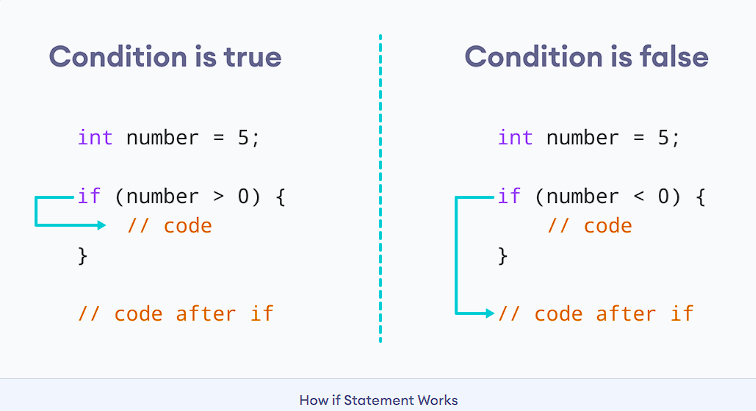
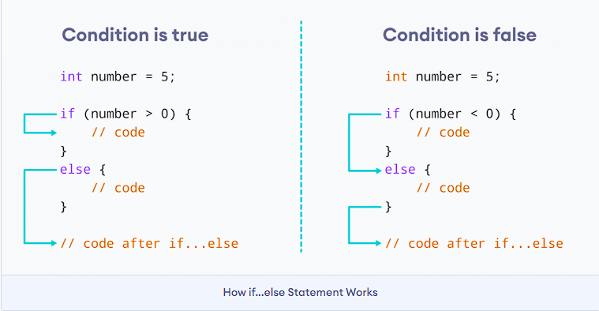
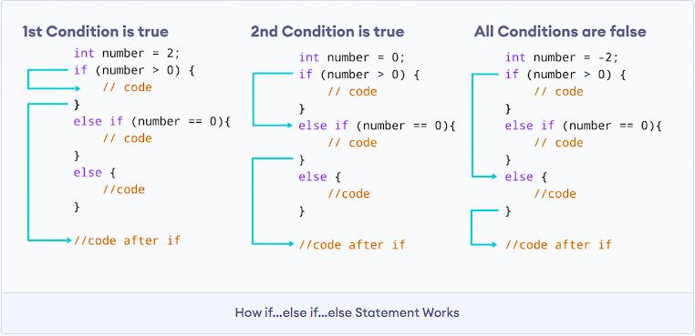
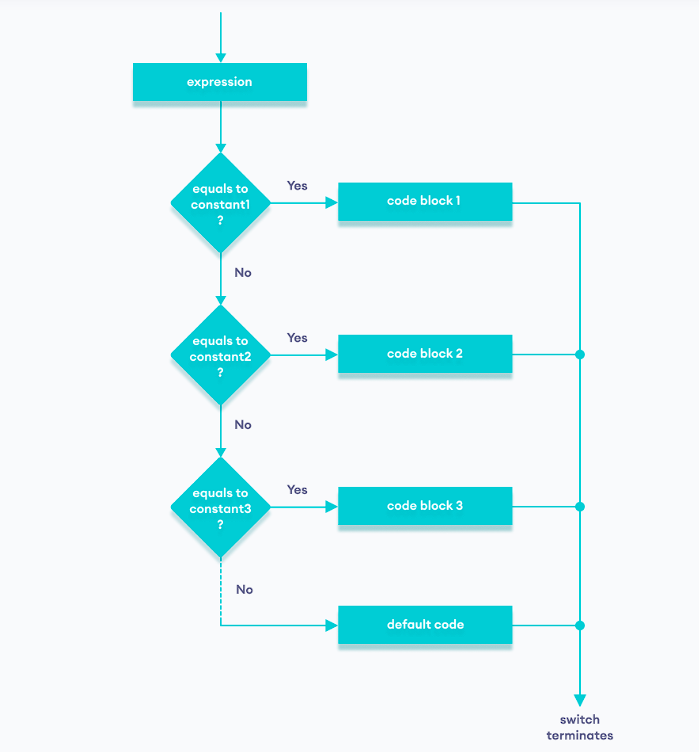

Conditional statements allow a program to **make decisions** based on conditions (true/false). They control the flow of execution.


* `if` → one condition.
* `if...else` → two paths.
* `if...else if...else` → multiple paths.
* `switch` → clean multi‑branch for constants.
* `?:` → compact one‑line decision.


## 🔹 Types of Conditional Statements

### 1. `if `**Statement**

* Executes a block if the condition is true.





**Syntax**

```
if (condition) {
  // body of if statement
}
```


The `if` statement evaluates the condition inside the parentheses `( )`.

1. If the condition evaluates to true, the code inside the body of `if` is executed.
2. If the condition evaluates to false, the code inside the body of `if` is skipped.

**Note:** The code inside `{ }` is the body of the `if` statement.


```cpp
int x = 10;
if(x > 0) {
    cout << "Positive number";
}
```


### 2. `if else` Statement

* Executes one block if condition is true, another if false.





The `if` statement can have an optional `else` clause.

**Syntax**

```
if (condition) {
  // block of code if condition is true
}
else {
  // block of code if condition is false
}
```

The `if..else` statement evaluates the condition inside the parenthesis.


```cpp
int x = -5;
if(x > 0) {
    cout << "Positive";
} else{
    cout << "Negative or Zero";
}
```

### 3. `if else if else`  Ladder

* Multiple conditions checked in sequence.

  

The `if...else` statement is used to execute a block of code among two alternatives. However, if we need to make a choice between more than two alternatives, we use the `if...else if...else` statement.

**Syntax**

```
if (condition1) {
  // code block 1
}
else if (condition2){
  // code block 2
}
else {
  // code block 3
}
```

Here,

1. If condition1 evaluates to true, the `code block 1` is executed.
2. If condition1 evaluates to false, then condition2 is evaluated.
3. If condition2 is true, the `code block 2` is executed.
4. If condition2 is false, the `code block 3` is executed.

**Note:** There can be more than one `else if` statement but only one `if` and `else` statements.


```cpp
int marks = 75;
if(marks >= 90) {
    cout << "Grade A";
} else if(marks >= 75) {
    cout << "Grade B";
} else{
    cout << "Grade C";
}
```


## Nested if...else

Sometimes, we need to use an `if` statement inside another `if` statement. This is known as nested `if` statement.

Think of it as multiple layers of `if` statements. There is a first, outer `if` statement, and inside it is another, inner `if` statement.

**Syntax**

```
// outer if statement
if (condition1) {

  // statements

  // inner if statement
  if (condition2) {
    // statements
  }
}
```

Notes:

1. We can add `else` and `else if` statements to the inner `if` statement as required.
2. The inner `if` statement can also be inserted inside the outer `else` or `else if` statements (if they exist).
3. We can nest multiple layers of `if` statements.


```cpp
// C++ program to find if an integer is positive, negative or zero
// using nested if statements

#include <iostream>
using namespace std;

int main() {

  int num;
  
  cout << "Enter an integer: ";  
   cin >> num;  

  // outer if condition
  if (num != 0) {
      
    // inner if condition
    if (num > 0) {
      cout << "The number is positive." << endl;
    }
    // inner else condition
    else {
      cout << "The number is negative." << endl;
    }  
  }
  // outer else condition
  else {
    cout << "The number is 0 and it is neither positive nor negative." << endl;
  }

  cout << "This line is always printed." << endl;

  return 0;
}
```


### 4. `switch` **Statement**

* Used when you want to compare a variable against multiple constant values.





```cpp
int day = 3;
switch(day) {
    case1: cout << "Monday"; break;
    case2: cout << "Tuesday"; break;
    case3: cout << "Wednesday"; break;
    default: cout << "Other day";
}
```


```cpp
// Program to build a simple calculator using switch Statement
#include <iostream>
using namespace std;

int main() {
    char oper;
    float num1, num2;
    cout << "Enter an operator (+, -, *, /): ";
    cin >> oper;
    cout << "Enter two numbers: " << endl;
    cin >> num1 >> num2;

    switch (oper) {
        case '+':
            cout << num1 << " + " << num2 << " = " << num1 + num2;
            break;
        case '-':
            cout << num1 << " - " << num2 << " = " << num1 - num2;
            break;
        case '*':
            cout << num1 << " * " << num2 << " = " << num1 * num2;
            break;
        case '/':
            cout << num1 << " / " << num2 << " = " << num1 / num2;
            break;
        default:
            // operator is doesn't match any case constant (+, -, *, /)
            cout << "Error! The operator is not correct";
            break;
    }

    return 0;
}
```


### 5.  **Ternary Operator (** `?:`**)**

* Short form of `if...else`.


```cpp
int x = 5;
string result = (x % 2== 0) ? "Even": "Odd";
cout << result;   // Output: Odd
```


## ✅ Quick Recall Table

| Statement Type      | Purpose                      | Example                                    |
| ------------------- | ---------------------------- | ------------------------------------------ |
| `if`              | Executesblockifconditiontrue | `if(x>0) cout<<"Positive";`              |
| `if else`         | Two-waydecision              | `if(x>0) cout<<"Pos"; else cout<<"Neg";` |
| `if else if else` | Multi-waydecision            | `if(m>=90) else if(m>=75)`               |
| `switch`          | Multi-branchonconstants      | `switch(day){case 1:...}`                |
| `?:`              | Compactconditional           | `(x%2==0?"Even":"Odd")`                  |


🧠 **Memory trick:**
Think of conditional statements as  **traffic signals** :

* `if` → green light (go if true).
* `else` → red light (stop, take other path).
* `else if` → yellow light (check another condition).
* `switch` → multiple roads, choose one.
* `?:` → shortcut lane.

## Misconceptions


# `&` vs `&&`

## 🔹 `&` (Bitwise AND)

* Works **bit by bit** on integers.
* Compares each bit of two numbers:
  * `1 & 1 → 1`
  * `1 & 0 → 0`
  * `0 & 0 → 0`
* Example:


```cpp
int a = 6;   // 110 in binary
int b = 3;   // 011 in binary
cout << (a & b);   // Output: 2 (010 in binary)
```

## 🔹 `&&` (Logical AND)

* Works on  **boolean expressions** .
* Returns `true` if  **both conditions are true** , else `false`.
* **Short‑circuit evaluation** : if the first condition is false, the second is not checked.
* Example:


```cpp
int x = 5, y = 10;
if(x > 0 && y > 0) {
    cout << "Both positive";   // true
}
```


# `Bitwise OR(|)` vs `Logical OR(||)`

## 🔹 `|` (Bitwise OR)

* Works **bit by bit** on integers.
* Compares each bit:
  * `1 | 1 → 1`
  * `1 | 0 → 1`
  * `0 | 0 → 0`
* Example:


```cpp
int a = 6;   // 110
int b = 3;   // 011
cout << (a | b);   // Output: 7 (111 in binary)
```

## 🔹 `||` (Logical OR)

* Works on  **boolean expressions** .
* Returns `true` if  **at least one condition is true** .
* **Short‑circuit evaluation** : if the first condition is true, the second is not checked.
* Example:

```cpp
int x = -5, y = 10;
if(x > 0|| y > 0) {
    cout << "At least one positive";   // true
}
```

# Comparison Table

| Operator | Type       | WorksOn        | Example          | Result              |
| -------- | ---------- | -------------- | ---------------- | ------------------- |
| `&`    | BitwiseAND | Integers(bits) | `6 & 3`        | `2 `(010)         |
| `&&`   | LogicalAND | Booleanexpr    | `(x>0 && y>0)` | true if bothtrue    |
| \|       | Bitwise OR | Integers(bits) | `6 \| 3`        | `7 `(111)         |
| \|\|     | Logical OR | Booleanexpr    | `(x>0 \|\| y>0)` | false if both false |

🧠 **Memory trick:**

* Single `&` / `|` → **bitwise** (works on bits).
* Double `&&` / `||` → **logical** (works on conditions, with short‑circuiting).
