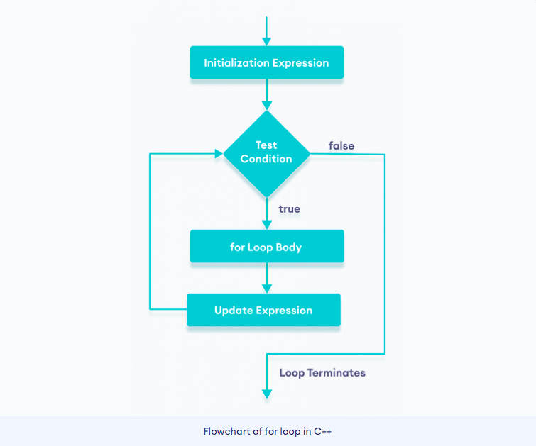
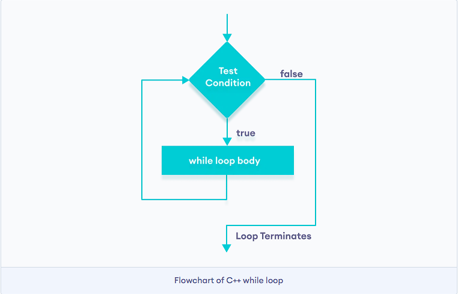
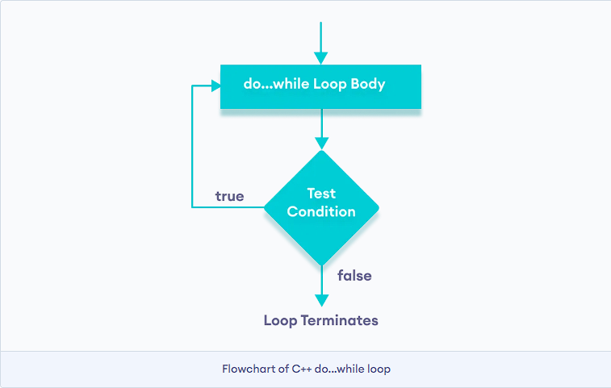

# Iterative Statements in C++

Iterative statements allow you to **execute code repeatedly** based on a condition. They’re essential for tasks like traversing arrays, processing input, or performing calculations multiple times.

## Types of Iterative Statements


There are **3** types of loops in C++.

1. `for` loop
2. `while` loop
3. `do...while` loop


### 1. `for` **Loop**

* Used when the number of iterations is known.


The syntax of for-loop is:


```cpp
for (initialization; condition; update) {
    // body of-loop 
}
```

Here,

* `initialization` - initializes variables and is executed only once
* `condition` - if `true`, the body of `for` loop is executed
  if `false`, the for loop is terminated
* `update` - updates the value of initialized variables and again checks the condition


## Flowchart of for Loop in C++




```cpp
#include <iostream>

using namespace std;

int main() {
    for (int i = 1; i <= 5; ++i) {
    cout << i << " ";
    }
    return 0;
}
```

 Output: ` 1 2 3 4 5`

**Flow:**

1. Initialization → `int i = 1`
2. Condition check → `i <=5`
3. Execute body → `cout << i`
4. Increment → `i++`
5. Repeat until condition is false.


Here is how this program works

| Iteration | Variable  | i         | Action                                  |
| --------- | --------- | --------- | --------------------------------------- |
| 1st       | `i = 1` | `true`  | 1is printed.`i`is increased to `2`. |
| 2nd       | `i = 2` | `true`  | 2is printed.`i`is increased to `3`. |
| 3rd       | `i = 3` | `true`  | 3is printed.`i`is increased to `4`. |
| 4th       | `i = 4` | `true`  | 4is printed.`i`is increased to `5`. |
| 5th       | `i = 5` | `true`  | 5is printed.`i`is increased to `6`. |
| 6th       | `i = 6` | `false` | The loop is terminated                  |


## Ranged Based for Loop

In C++11, a new range-based `for` loop was introduced to work with collections such as [arrays]() and [vectors](). Its syntax is:

```cpp
for (variable : collection) {
    // body of loop
}
```

Here, for every value in the collection, the for loop is executed and the value is assigned to the variable.

```cpp
#include <iostream>

using namespace std;

int main() {
  
    int num_array[] = {1, 2, 3, 4, 5, 6, 7, 8, 9, 10};
  
    for (int n : num_array) {
        cout << n << " ";
    }
  
    return 0;
}
```


**Output**

<pre><samp>1 2 3 4 5 6 7 8 9 10</samp></pre>

In the above program, we have declared and initialized an `int` array named num_array. It has 10 items.

Here, we have used a range-based `for` loop to access all the items in the array.


### C++ Infinite for loop

If the `condition` in a `for` loop is always `true`, it runs forever (until memory is full). 

For example,

```cpp
// infinite for loop
for(int i = 1; i > 0; i++) {
    // block of code
}
```

In the above program, the `condition` is always `true` which will then run the code for infinite times.


## 2. while Loop


- Used when the number of iterations is  **not known in advance** .

The syntax of the `while` loop is:

```cpp
while (condition) {
    // body of the loop
}
```

Here,

* A `while` loop evaluates the `condition`
* If the `condition` evaluates to `true`, the code inside the `while` loop is executed.
* The `condition` is evaluated again.
* This process continues until the `condition` is `false`.
* When the `condition` evaluates to `false`, the loop terminates.


### Flowchart of while Loop





Example:

Display Numbers from 1 to 5

```cpp
// C++ Program to print numbers from 1 to 5

#include <iostream>

using namespace std;

int main() {
    int i = 1; 

    // while loop from 1 to 5
    while (i <= 5) {
        cout << i << " ";
        ++i;
    }
  
    return 0;
}
```


**Output**

<pre><samp>1 2 3 4 5</samp></pre>

Here is how the program works.

| Iteration | Variable  | i <= 5    | Action                                      |
| --------- | --------- | --------- | ------------------------------------------- |
| 1st       | `i = 1` | `true`  | 1is printed and `i`is increased to `2`. |
| 2nd       | `i = 2` | `true`  | 2is printed and `i`is increased to `3`. |
| 3rd       | `i = 3` | `true`  | 3is printed and `i`is increased to `4`  |
| 4th       | `i = 4` | `true`  | 4is printed and `i`is increased to `5`. |
| 5th       | `i = 5` | `true`  | 5is printed and `i`is increased to `6`. |
| 6th       | `i = 6` | `false` | The loop is terminated                      |


## do...while Loop

The `do...while` loop is a variant of the `while` loop with one important difference: the body of `do...while` loop is executed once before the `condition` is checked.

Its syntax is:


```cpp
do {
   // body of loop;
}
while (condition);
```

Here,

* The body of the loop is executed at first. Then the `condition` is evaluated.
* If the `condition` evaluates to `true`, the body of the loop inside the `do` statement is executed again.
* The `condition` is evaluated once again.
* If the `condition` evaluates to `true`, the body of the loop inside the `do` statement is executed again.
* This process continues until the `condition` evaluates to `false`. Then the loop stops.


### Flowchart of do...while Loop





### Example: Display Numbers from 1 to 5


```cpp

// C++ Program to print numbers from 1 to 5

#include <iostream>

using namespace std;

int main() {
    int i = 1; 

    // do...while loop from 1 to 5
    do {
        cout << i << " ";
        ++i;
    }
    while (i <= 5);
  
    return 0;
}
```


**Output**

<pre><samp>1 2 3 4 5</samp></pre>

Here is how the program works.

| Iteration | Variable  | i <= 5      | Action                                          |
| --------- | --------- | ----------- | ----------------------------------------------- |
|           | `i = 1` | not checked | 1is printed and `i`is increased to 2          |
| 1st       | `i = 2` | `true`    | 2is printed and `i`is increased to 3          |
| 2nd       | `i = 3` | `true`    | 3is printed and `i`is increased to 4          |
| 3rd       | `i = 4` | `true`    | 4is printed and `i`is increased to 5          |
| 4th       | `i = 5` | `true`    | 5is printed and `i`is increased to**6** |
| 5th       | `i = 6` | `false`   | The loop is terminated                          |


## Infinite while loop

If the `condition` of a loop is always `true`, the loop runs for infinite times (until the memory is full). For example,

```cpp
// infinite while loop
while(true) {
    // body of the loop
}
```

Here is an example of an infinite `do...while` loop.

```cpp
// infinite do...while loop

int count = 1;

do {
   // body of loop
} 
while(count == 1);
```

In the above programs, the `condition` is always `true`. Hence, the loop body will run for infinite times.


## for vs while loops

A `for` loop is usually used when the number of iterations is known. For example,

```cpp
// This loop is iterated 5 times
for (int i = 1; i <=5; ++i) {
   // body of the loop
}
```

Here, we know that the for-loop will be executed 5 times.

However, `while` and `do...while` loops are usually used when the number of iterations is unknown. For example,

```cpp
while (condition) {
    // body of the loop
}
```
